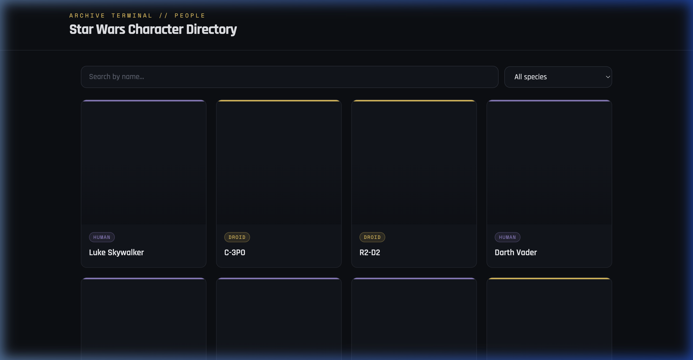
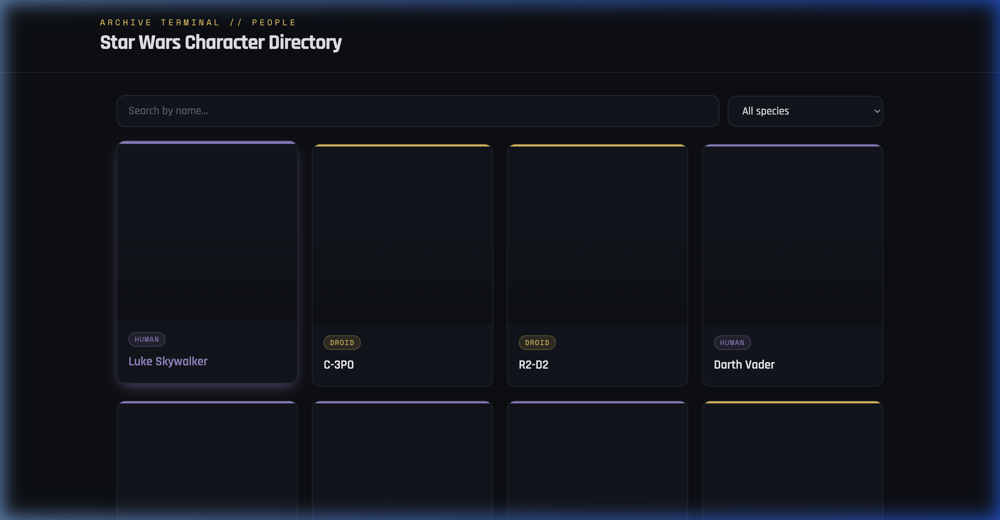
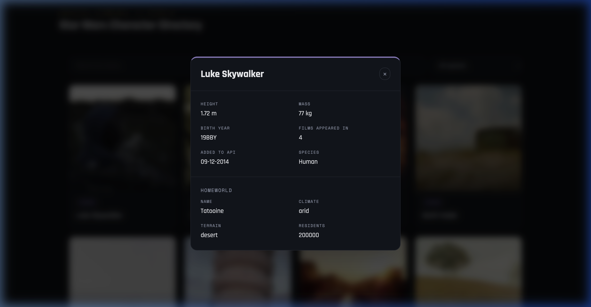

# Star Wars Character Directory

A React + TypeScript app that browses Star Wars characters from [SWAPI.info](https://swapi.info/api/people), with client-side pagination, species-based card coloring, hover animations, a details modal (with homeworld lookup), search, and species filtering.

**Live demo:** https://fabulous-gnome-787baa.netlify.app
**GitHub:** https://github.com/utsavanand0209/tsx-mern-05Aug2026
**Video walkthrough:** _add your Drive/YouTube link here_

## Features

- **List view** — fetches all characters from `/people` and paginates client-side (12 per page), since the API returns the full collection in one payload rather than paging server-side.
- **Loading & error states** — a loader while fetching/refetching, and a dedicated error state with a Retry button if the API is unreachable.
- **Character cards** — each card shows the character's name and a stable "random" picture from Picsum (seeded per character, so it doesn't change on every re-render), colored by species, with a hover lift/glow animation.
- **Details modal** — clicking a card opens a modal with name, height (converted to meters), mass (kg), date added to the API (`dd-MM-yyyy`), number of films, and birth year. It also fetches and displays the character's homeworld (name, terrain, climate, population).
- **Search & filter (bonus)** — search by name (partial match) and filter by species; both combine together.
- **Integration test (bonus)** — Vitest + React Testing Library test verifying the modal opens with the correct character's data (and that switching characters doesn't leak stale data).
- **JWT auth with silent refresh (bonus)** — mock login page (demo credentials shown on screen), access token kept in React memory (XSS-safe, 5 min TTL), refresh token in `localStorage` (1 hr TTL). A background timer silently re-issues the access token 60 s before expiry so users are never interrupted. Session is restored automatically on page reload while the refresh token is still valid.


## Tech stack

- React 19 + TypeScript
- Vite
- Tailwind CSS v4
- Vitest + React Testing Library

## Getting started

```bash
npm install
npm run dev       # start dev server
npm run build     # type-check + production build
npm run test      # run the integration test suite
```

## Project structure

```
src/
  api/swapi.ts          # fetch wrapper + typed API calls, central error handling
  hooks/useCharacters.ts # loads people, resolves species names, builds view models
  components/            # CharacterCard, CharacterModal, SearchFilter, Pagination, Loader, ErrorState
  utils/format.ts        # unit conversion, date formatting, species color mapping
  test/                  # Vitest setup + integration test
```

## Design notes

- Dark "archive terminal" aesthetic (monospace labels, amber accent) to fit a Star Wars data-terminal feel without leaning on any licensed art or fonts.
- Each species gets a deterministic accent color (hashed from the species name) so the same species always renders the same color across sessions.
- Accessibility: modal traps focus on open, closes on `Escape` or backdrop click, uses `role="dialog"`/`aria-modal`, and all interactive elements have visible focus states. Reduced-motion is respected.

## Screenshots

### Character Grid


### Hover State


### Details Modal

